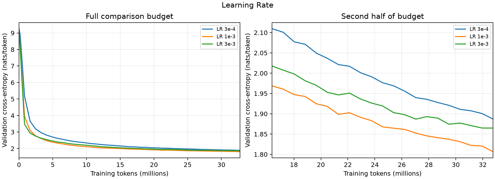
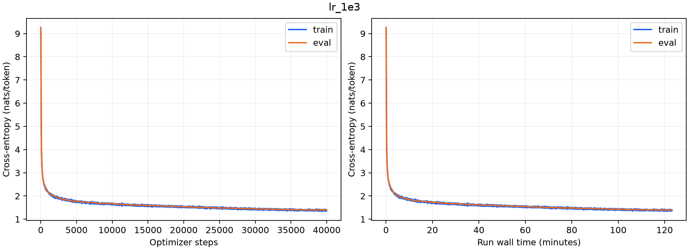
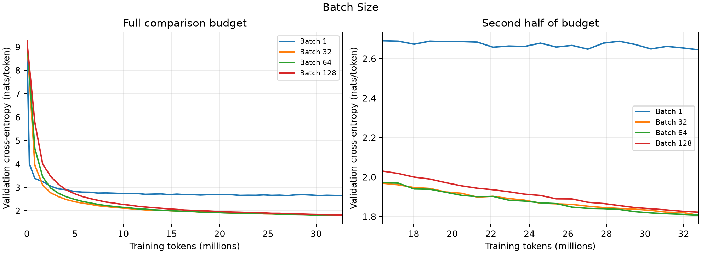
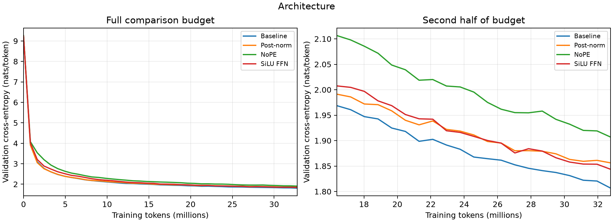
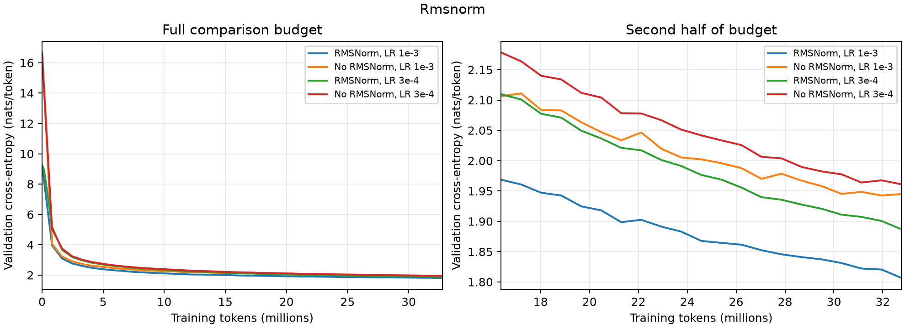
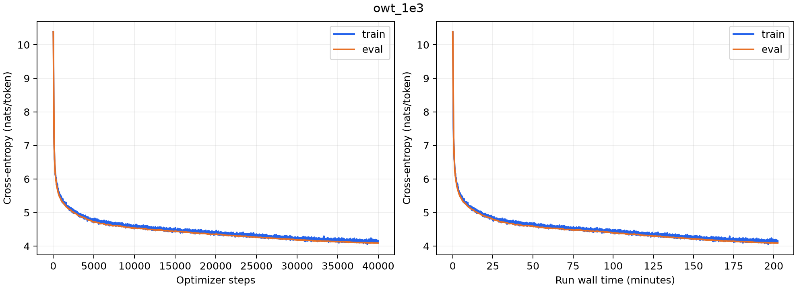

# CS336 Assignment 1 — Basics 实验报告

作者：Gary · 仓库：Gary-CF/assignment1-basics · 实验环境：WSL / RTX 5060 Laptop GPU

本报告按仓库中的 [Assignment 1 题目](cs336_assignment1_basics.pdf) 组织，记录从 byte-level BPE、Transformer 实现到 TinyStories / OpenWebText（OWT）训练的结果。实测数字来自本项目训练日志、统计脚本和终端输出；资源计算是按明确假设得到的理论估算。实验主要在 2026-09-18 至 2026-09-20 完成。

**报告更新：2026-09-20。** 本版依据远程 `main` 在 `e16c211` 时的代码和已归档实验产物核对。报告与实验材料提交于 `b8ab4b9`，生成及实验工具补交于 `1dca9e7`，开发分支通过 `24f120f` 合并到自己的 fork 的 `main`。这些是项目里程碑，不代表所有严格实验要求都无范围限制。

## 1. 完成情况与实验口径

| 项目 | 结果 |
|---|---|
| 官方单元测试 | `uv run pytest -q`：**47 passed, 1 xpassed，19.94 s** |
| TinyStories 完整训练 | 40,000 步，327,680,000 tokens；最佳验证 loss **1.396528** |
| OWT 完整训练 | 40,000 步，327,680,000 tokens；最佳验证 loss **4.090724** |
| 文本生成 | TinyStories 187 个新 tokens 后遇到 EOS；OWT 达到 256 个新 tokens |
| 对照实验 | 学习率、batch size、移除 RMSNorm、post-norm、NoPE、SiLU FFN |
| 数据处理 | 两套 tokenizer；两套语料 train / valid 均完成 uint16 编码 |
| 实验记录 | JSONL、PNG/SVG 曲线、checkpoint、W&B offline 日志 |
| 证据归档 | 清单中 50 个小文件、约 6.90 MiB；已逐一复核文件 SHA-256，与清单一致 |
| 版本交付 | 实现、实验工具、报告和精选证据已进入 fork 的 `main`；大语料和训练 checkpoint 保留本机 |

上述测试结果来自本机最终运行的终端记录，本次文档更新没有重跑 GPU 训练。`test_encode_memory_usage` 原标记为预期失败，本次为 XPASS；该结果没有造成测试失败，也不意味着任意输入下都具有常数内存开销。这里的单元测试成绩不能替代下面对实验题覆盖范围的说明。

**验证口径：**语言模型的验证 loss 是固定抽样的 80 条、每条 256 tokens 的序列上的平均交叉熵，单位为 nats/token；不是遍历整个验证集。训练 loss 来自训练日志窗口，与验证集取样方式不同。实验使用单个随机种子，没有多种子置信区间。所有“更好”均限定于相应数据、预算和超参数。

**仍有范围限制：**TinyStories BPE 使用 300 MB 子集；高学习率实验没有严格确定发散边界；micro-batch 探测未找到物理显存上限；不同 batch 没有逐一重调学习率。详见第 13 节。没有参加 B200 45 分钟 leaderboard，不能将本机 OWT 成绩作为该榜单成绩。

## 2. Unicode 与字节编码

对应 `unicode1`、`unicode2`。

### 2.1 字符、表示与打印

`chr(0)` 返回 Unicode 码点 U+0000，即 NUL 字符。交互式表示或 `repr(chr(0))` 通常显示为 `'\x00'`，而 `print(chr(0))` 输出的是控制字符本身，一般看不到可见字形。

`"a" + chr(0) + "b"` 是长度为 3 的 Python 字符串。NUL 仍然占一个字符位置；Python 字符串不会像某些以 NUL 结尾的 C 字符串接口一样，在这里自动截断。打印时看不到中间字符，不代表它不存在。

### 2.2 为什么采用 UTF-8

Byte-level BPE 先把文本变为字节。UTF-8 对 ASCII 字符只需一个字节，适合本实验以英文为主的语料；其字节序列也不需要像 UTF-16/32 那样选择大端或小端。但不能据此声称 UTF-8 对所有语言都最节省空间。

UTF-8 字符可能跨多个字节。例如 `"é".encode("utf-8") == b'\xc3\xa9'`；分别解码 `b'\xc3'` 和 `b'\xa9'` 会失败。因此 tokenizer 的 decode 先拼接全部 token 的字节，再进行一次 UTF-8 解码。对模型生成的无效字节序列使用 `errors="replace"`，这是生成容错，不是逐字节解码。

一个无效的双字节序列是 `b'\xc3\x28'`：`0xc3` 要求后接 continuation byte，`0x28` 不满足要求，严格 UTF-8 解码会报错。

## 3. BPE 训练与分析

对应 `train_bpe`、`train_bpe_tinystories`、`train_bpe_expts_owt`。

### 3.1 算法与正确性

普通文本使用 GPT-2 正则预切分；特殊 token `<|endoftext|>` 独立处理，合并不跨文档边界。初始词表包含 256 种单字节与一个特殊 token。每轮选择加权出现频率最高的相邻 pair；频率相同时选择 bytes 元组字典序较大的 pair，然后在受影响的 pretoken 内从左到右合并不重叠的出现。

优化版维护 pair 频率、pair 到词的反向索引以及频率桶，每轮只更新受影响词，避免对整个词频表重新计数。必须按“词频 × 词内出现次数”更新频率；反向索引中同一个词则只保留一次。官方 BPE 正确性、特殊 token 和速度测试均通过。早期优化对照记录约为 0.43 s，朴素版约 2.93 s；这是当时的计时，不能与带 profiler 的大语料计时直接比较。

OWT 使用另一个基于 SQLite 的磁盘索引训练脚本，以容纳完整语料的词频和 pair 索引，并支持阶段性恢复；语言模型消费其产生的标准 `(vocab, merges)`，不依赖 SQLite。

### 3.2 实测资源与最长 token

| 项目 | TinyStories | OWT |
|---|---:|---:|
| 训练输入字节数 | 300,000,000（子集） | 11,920,511,059（提供的 OWT 训练文件全量） |
| 词表大小 | 10,000 | 32,000 |
| 合并次数 | 9,743 | 31,743 |
| 训练时间 | 177.362 s，开启 cProfile | 6,171.242 s，跨会话累计，约 102.85 min |
| 报告中的进程峰值 RSS | 1.582 GiB | 当前进程 0.108 GiB |
| 最长普通 token 长度 | 15 bytes | 64 bytes |

两个合并次数分别等于词表大小减去 257。TinyStories 的复跑产物与原先用于训练模型的 tokenizer 在 vocab、merges 和 special_tokens 上完全一致。

TinyStories 的最长 token 是 `b' responsibility'`（id 9401），包含词前空格，符合 GPT-2 预切分习惯，也是儿童故事中合理的主题词。OWT 的统计输出给出一个由 `ÃÂ` 重复组成的 64-byte token。它的字节是合法 UTF-8，但可见内容像已有编码错误形成的乱码；重复模式能被 BPE 逐步合并，不代表具有语言学意义。更大的词表和更多样、更嘈杂的网页数据共同影响了此结果，不能把差异完全归因于语料领域。

OWT 有 6,601,892 个唯一 pretokens，累计出现 2,471,753,092 次；SQLite 数据库约 1.36 GB。0.108 GiB 是最终统计进程的 high-water RSS，**不是所有历史会话或整个系统的峰值内存**，也不包含完整的操作系统文件缓存占用。

### 3.3 Profiling

TinyStories profile 总计 177.248 s，其中 `build_word_counts` 累计 167.282 s，约占 94.4%。主要成本在预切分后的字节 tuple 构造、编码和词频统计；字节生成器自身记录了 44.065 s。此时主要瓶颈已经从全量 pair 重计数转移到预处理。累计时间包含子调用，不能把 `build_word_counts` 和其内部生成器的时间相加当作互不重叠的时间。

原始证据：[TinyStories BPE 摘要](reports/bpe/tinystories_10k/summary.json)、[profile](reports/bpe/tinystories_10k/profile.txt)、[OWT BPE 摘要](reports/bpe/owt_32k/summary.json)。

177.362 s 包含 profiler 开销，只用于描述这次测量，不能当作无 profiler 的生产吞吐。TinyStories 使用 300 MB 子集也是重要范围限制：这次资源统计不等价于全量 TinyStories BPE 的资源统计。

## 4. Tokenizer 压缩、吞吐与数据编码

对应 `tokenizer`、`tokenizer_experiments`。

### 4.1 编解码

编码时，merge 列表的下标就是优先级：对每个 pretoken 反复合并当前 rank 最小的 pair，直到没有可合并的 pair。特殊 token 按长度降序匹配，避免较短 token 抢先匹配较长 token 的前缀。decode 拼接字节后统一解码。

官方测试覆盖 GPT-2 词表逐 ID 对拍、Unicode、特殊 token、流式编码及内存场景。流式实现通过保留尚未确定边界的文本来避免整份语料驻留内存；但“没有安全边界的极长文本片段”仍可能使缓冲区增长，不能由一次内存测试通过推出对所有字符串都有固定上界。全量编码脚本按文档处理，并设置文档大小保护。

### 4.2 10 篇文档压缩实验

从两个验证文件各抽取 10 篇文档；TinyStories tokenizer 和 OWT tokenizer 分别使用 10K / 32K 词表。跨域比较复用同一组 OWT 文档。比值定义为 `UTF-8 bytes / encoded tokens`，越高表示每个 token 平均承载更多字节，不代表最终存储压缩算法的压缩率。

| Tokenizer → 样本 | UTF-8 bytes | tokens | bytes/token |
|---|---:|---:|---:|
| TinyStories → TinyStories | 8,733 | 2,106 | 4.146724 |
| OWT → OWT | 148,952 | 35,850 | 4.154868 |
| TinyStories → OWT | 148,952 | 48,882 | 3.047175 |

对相同 OWT 文本，TinyStories tokenizer 产生约 36.35% 更多 tokens，说明它对这组网页文本的切分更碎。但此比较同时改变了训练领域和词表大小，不能作为纯粹的领域迁移因果实验。

### 4.3 吞吐与 825 GB 外推

文档已经在内存中，重复 3 次取中位数；每次使用新的 tokenizer / cache，单进程，只计 encode 时间。缓存版本使用有界的 32,768 项 pretoken 缓存。825 GB 按十进制 `825 × 10^9` bytes 计算。

| Tokenizer → 样本 | 原版 bytes/s | 原版 825 GB 估计小时 | 缓存版 bytes/s | 缓存版估计小时 |
|---|---:|---:|---:|---:|
| TinyStories → TinyStories | 861,240 | 266.09 | 1,876,939 | 122.10 |
| OWT → OWT | 695,356 | 329.57 | 1,538,040 | 149.00 |
| TinyStories → OWT | 884,969 | 258.95 | 3,112,961 | 73.62 |

计算方式为 `825e9 / bytes_per_second / 3600`。这些是小样本外推，不是对 The Pile 的实际全量计时；没有包括读写开销。TinyStories 样本只有约 9 KB，计时容易受到调度和缓存波动影响。全量编码长时间保持 warm cache，其吞吐与本表冷启动短样本计时不同，并不矛盾。

### 4.4 全量 train / valid 编码

| 数据 | token 数量 | uint16 文件字节数 |
|---|---:|---:|
| TinyStories train | 541,252,216 | 1,082,504,432 |
| TinyStories valid | 5,466,269 | 10,932,538 |
| OWT train | 2,727,120,452 | 5,454,240,904 |
| OWT valid | 66,401,098 | 132,802,196 |

每个文件的字节数都等于 token 数乘 2。10K 和 32K 词表的 ID 都能用 16-bit 无符号整数表示，因此 uint16 可将数据存储量降到 int32 的一半、int64 的四分之一。送入 PyTorch embedding 前，batch 转为 LongTensor。裸二进制没有自带形状和字节序元数据，本环境输出为 little-endian；跨平台读取时应显式匹配 dtype / byteorder。

OWT train 编码耗时 3,163.836 s，valid 耗时 72.192 s；各自输入 offset 与原文件字节数相同，状态为 `complete`，ID 范围均为 `[0, 31999]`。对应文档数为 2,399,397 和 59,059。两者使用相同 tokenizer SHA-256，前 500 个 tokens 解码可读。该检查支持文件完整性与基本可读性，不等于独立重编码整个语料进行逐 ID 对拍。

Tokenizer 文件 SHA-256：

- TinyStories：`c2926da105ed104b9345c09c84d473ecbaa227984ac1077365844918440adc30`
- OWT：`b0fcf22a910fddf2e8682b568c5eb1477d7fe034567186452ace8fa9d759ed92`

## 5. 模型结构与形状

记 batch 为 $B$，序列长度为 $T$，模型宽度为 $D$，头数为 $H$，每头宽度 $d_k=D/H$，FFN 宽度为 $F$，层数为 $L$，词表大小为 $V$。

主数据流为 token IDs `[B,T]` → embedding `[B,T,D]` → $L$ 个 Transformer blocks `[B,T,D]` → final RMSNorm `[B,T,D]` → vocabulary projection `[B,T,V]`。训练时将 logits 视为 `[BT,V]`、targets 视为 `[BT]` 来计算 next-token cross-entropy。

每个 pre-norm block 为：

$$
u=x+\operatorname{Attention}(\operatorname{RMSNorm}_1(x)),\qquad
y=u+\operatorname{SwiGLU}(\operatorname{RMSNorm}_2(u)).
$$

Q/K/V 投影后从 `[B,T,D]` 分头为 `[B,H,T,d_k]`；Q、K 应用 RoPE；$QK^\top/\sqrt{d_k}$ 为 `[B,H,T,T]`。因果 mask 保留当前位置和过去位置，`True` 表示保留。softmax 后乘 V 得到 `[B,H,T,d_k]`，合头回 `[B,T,D]`，再做 output projection。

$$
\operatorname{SwiGLU}(x)=W_2\bigl(\operatorname{SiLU}(W_1x)\odot W_3x\bigr),\qquad
\operatorname{SiLU}(z)=z\sigma(z).
$$

这里 $W_1$ 为 gate，$W_3$ 为 up，$W_2$ 为 down。模型无线性 bias，输入 embedding 与输出 head 不共享权重。RMSNorm 在最后一个维度归一化；softmax 先减去该行最大值，cross-entropy 使用稳定的 log-sum-exp，避免直接指数带来的溢出。

## 6. Transformer resource accounting

对应 `transformer_accounting`。矩阵乘法按一次乘法、一次加法合计 2 FLOPs；本节只统计主矩阵乘法，不包含 RoPE、norm、softmax、激活和掩码的逐元素运算。因果注意力按密集 $T\times T$ 运算统计，不能因为 mask 就自动减半。

### 6.1 参数量与加载内存

参数由两个 embedding / head 矩阵、每层四个 attention 投影、三个 FFN 矩阵和 norm 权重组成：

$$
P=2VD+L(4D^2+3DF+2D)+D.
$$

题目 XL 配置 $V=50257,T=1024,L=48,D=1600,H=25,F=4288$，得 **1,640,452,800** 个参数。只加载 FP32 参数需要 **6,561,811,200 bytes = 6.111 GiB**；这里不含梯度、optimizer states、激活或 allocator 额外空间。

### 6.2 前向 FLOPs

以下均为单条长度 $T$ 的序列；batch 为 $B$ 时整体乘 $B$。

| 矩阵乘法 | 全部层的 FLOPs | XL 数值 |
|---|---:|---:|
| Q、K、V 和 attention output 投影 | $8LTD^2$ | 1,006,632,960,000 |
| attention scores $QK^\top$ 与加权值 $AV$ | $4LT^2D$ | 322,122,547,200 |
| SwiGLU 的 gate / up / down | $6LTDF$ | 2,023,332,249,600 |
| 输出 head | $2TDV$ | 164,682,137,600 |
| 合计 | $8LTD^2+4LT^2D+6LTDF+2TDV$ | **3,516,769,894,400** |

输入 embedding 是查表，不计为稠密矩阵乘法。XL 在此上下文长度下，FFN 占 **57.53%**，是最大的计算项。

### 6.3 模型规模的影响

$F$ 采用接近 $8D/3$ 的 64 倍数；本表保持 $V=50257,T=1024$。

| 模型 | $L,D,H,F$ | 参数量 | 总前向 FLOPs | Attention 投影 | Scores / values | FFN | Head |
|---|---|---:|---:|---:|---:|---:|---:|
| Small | 12,768,12,2048 | 162,148,608 | 291,648,307,200 | 19.88% | 13.25% | 39.76% | 27.10% |
| Medium | 24,1024,16,2752 | 406,539,264 | 830,172,299,264 | 24.83% | 12.42% | 50.05% | 12.70% |
| Large | 36,1280,20,3392 | 833,591,040 | 1,768,530,903,040 | 27.32% | 10.93% | 54.30% | 7.45% |
| XL | 48,1600,25,4288 | 1,640,452,800 | 3,516,769,894,400 | 28.62% | 9.16% | 57.53% | 4.68% |

随深度和宽度增加，层内投影及 FFN 的占比上升；只计算一次的输出 head 占比下降。在这里固定 $T$ 的比较中，$D^2$ 投影项比 $T^2D$ 注意力项增长得更快，后者占比下降。

### 6.4 长上下文

XL 的 $T$ 从 1,024 增至 16,384 后，总前向 FLOPs 为 **133,577,729,638,400**，约是原来的 37.98 倍。四项占比分别为 **12.06%、61.73%、24.24%、1.97%**：长度增加 16 倍时，投影项增加 16 倍，而密集 attention scores / values 增加 256 倍，成为主导。

### 6.5 本项目实际模型

| 配置 | TinyStories | OWT |
|---|---:|---:|
| $V,T,L,D,H,F$ | 10000,256,4,512,16,1344 | 32000,256,4,512,16,1344 |
| 参数量 | 22,696,448 | 45,224,448 |
| 单序列前向矩阵乘法 FLOPs | 9,533,652,992 | 15,300,820,992 |

OWT 保持相同 Transformer 主体结构，但更大的词表增加了 embedding / head 参数和输出 head 计算。因此“同结构、同迭代数”并不意味着实际 FLOPs 和参数量完全相同。

## 7. SGD 与 AdamW resource accounting

### 7.1 SGD 学习率实验

对应 `learning_rate_tuning`。以 seed 336 初始化 $10\times10$ 的权重矩阵，损失为所有元素平方的平均值，使用步长 $\alpha/\sqrt{t+1}$，运行 10 次更新。初始损失为 24.936384。

| 基础学习率 $\alpha$ | 10 次更新后的 loss |
|---:|---:|
| 1 | 20.374941 |
| 10 | 2.940821 |
| 100 | $2.6051\times10^{-24}$ |
| 1000 | $6.5527\times10^{19}$ |

由于总计 100 个参数，单个参数的梯度为 $w/50$，所以第 $t$ 次更新满足

$$w_{t+1}=\left(1-\frac{\alpha}{50\sqrt{t+1}}\right)w_t.$$

loss 因而乘以该系数的平方。$\alpha=100$ 的第一次更新系数是 −1，loss 不变，但随后系数绝对值迅速变小；$\alpha=1000$ 在这 10 步中出现剧烈增长。打印在更新之前的第 10 个 loss 并不等于更新 10 次之后的 loss，本表使用后者。这个简单二次问题的结论不能直接迁移成 Transformer 的可用学习率。

### 7.2 AdamW 内存表达式

对应 `adamw_accounting`。本小节遵循题目假设：**所有张量 FP32，且 $F=8D/3$ 不做整数取整**。它与第 6 节 XL 的 $F=4288$ 不是同一个参数口径。

此时参数量为

$$P=2VD+L(12D^2+2D)+D.$$

参数占 $4P$ bytes，梯度占 $4P$，AdamW 的一阶、二阶状态共占 $8P$；不含激活时合计 **$16P$ bytes**。

激活采用明确的简化约定：题目列出的每个操作保留一份输出，不计额外临时 workspace、残差副本、梯度中间张量或算子融合节省。每层两个 norm 共 $2BTD$，QKV 共 $3BTD$，scores 和 softmax 共 $2BHT^2$，加权 V 与 attention output 共 $2BTD$；FFN 的两个上投影、SiLU 和逐元素积共 $4BTF$，下投影 $BTD$。因此每层合计 $8BTD+4BTF+2BHT^2$ 个元素。

再加 final norm 的 $BTD$、输出 logits 的 $BTV$，并为 cross-entropy 保留一份 $BTV$ 中间结果，得到激活元素数

$$A=B\left[L\left(\frac{56}{3}TD+2HT^2\right)+TD+2TV\right].$$

总内存估算为 **$M=16P+4A$ bytes**。这是按所声明保留规则得到的模型，不等价于某个具体 autograd 实现的精确峰值。实际 BF16 训练也不遵循“所有激活 FP32”的前提。

代入 XL（未取整的 $F=8D/3$）：

$$M(B)=26,168,601,600+16,356,614,144B\quad\text{bytes}.$$

在十进制 80 GB 下，最大整数 batch 为 **3**；即使把容量解释为 80 GiB，结果仍为 3。这未预留系统、allocator 或临时算子的额外空间，不能直接当作实际训练 batch 的承诺。

### 7.3 AdamW 单步 FLOPs

沿用题目伪代码，将修正后的标量学习率预先算好，且把 $1-\alpha\lambda$ 预先合并成一个衰减系数。对每个参数，一阶矩更新需 3 次算术操作，二阶矩需 4 次，参数乘衰减系数需 1 次，最终 moment 更新的开方、加 epsilon、除法、乘修正学习率、减法共 5 次。把开方和除法各按 1 次操作计，得到约 **$13P$ FLOPs/step**，另有每个参数组的常数级标量运算。

这个计数约定用于粗略计算量比较；开方、除法在硬件上的成本不等于一次 FMA，实际 optimizer 往往受内存读写限制。若不预合并衰减系数或采用不同偏差修正写法，常数项会略有不同，但量级仍是 $O(P)$。

对应当前 `cs336_basics/training.py`，实现显式构造 `m_hat`、`v_hat`，再执行合并后的 weight decay，按相同计数规则约为 **$15P$**。直接按题目未合并 weight decay 的伪代码计数则约为 **$14P$**。三者的差别是写法和计数约定，不是参数量发生变化。

### 7.4 H100 时间估计

采用题目给定的 495 TFLOP/s 和 50% MFU，等效吞吐为 $247.5\times10^{12}$ FLOP/s。使用第 6 节 $F=4288$ 的 XL 前向数值 $C=3,516,769,894,400$；反向为前向两倍，则 400,000 步、batch 1,024 的主要训练计算时间为

$$\frac{400000\times1024\times3C}{247.5\times10^{12}\times3600}
=\mathbf{4850.06\ hours}.$$

加入上面 $13P$ 的 optimizer 计算约再增加 0.01 h，对该估算影响很小。若本小问也沿用未取整的 $F=8D/3$，对应约 **4836.18 h**；差别来自 FFN 宽度取值，应避免把两个口径混用。这是吞吐假设下的计算时间外推，没有解决单卡 batch 1,024 的实际内存可行性，也不包含通信、数据读取和 checkpoint I/O。

## 8. 训练、日志与恢复

对应训练实现和 `experiment_log`。

| 项目 | 基准设置 |
|---|---|
| 环境 | PyTorch 2.11.0+cu130，RTX 5060 Laptop GPU，物理显存约 7.96 GiB |
| 模型 | $T=256,L=4,D=512,H=16,F=1344$，RoPE theta=10000 |
| 有效 batch | micro-batch=4，梯度累积 8 次，共 32 条序列 |
| 优化器 | AdamW，betas=(0.9,0.95)，epsilon=$10^{-8}$，weight decay=0.1 |
| 梯度裁剪 | global norm 上限 1；日志中 grad_norm 为裁剪前值 |
| 日程 | 40,000 optimizer steps，warmup 200，余弦下降到峰值 LR 的 0.1 倍 |
| 精度 | FP32 参数 / optimizer 状态，BF16 autocast |
| 数据 | uint16 memmap，随机连续窗口，target 相对 input 右移一个 token |
| 记录 | 每 10 步 train、每 100 步 eval、每 200 步 checkpoint，seed=336 |

梯度累积时，每个 micro-batch 的 loss 除以累积次数，累积完成后裁剪并执行一次 optimizer step。学习率写入 optimizer 的 `param_groups`；只设置实例上的 `optimizer.lr` 不会改变实际更新步长。

checkpoint 保存模型、optimizer、完成步数和运行配置，并保存恢复所需的随机状态及累计运行时间。恢复时保持模型和训练设置兼容；允许用不同 micro-batch / grad-accum 组合维持相同有效 batch。`--stop-after` 表示完成到某个绝对步数后暂停，不改变原本的余弦日程长度。

JSONL 中记录 step、tokens、wall_seconds、loss、LR、grad norm、tokens/s 和显存分配量。W&B 使用 **offline** 模式；此报告不声称日志已经同步到在线 dashboard。wall_seconds 使用运行时累计值，暂停期间的实际日历等待时间不应视为训练耗时。

TinyStories lr=1e-3 曾误启动第二个写入同一目录的进程，随后终止。事后检查没有损坏 JSON 行，发现 8 条重复记录。最新对比摘要中，baseline 有 2 条重复 eval，lr_1e3 有 3 条，batch1 有 1 条，其余对照没有重复 eval；所有对照的验证 loss / token 数冲突为 0。“8 条”是 lr_1e3 早前检查的 train / eval 合计，与分运行仅统计 eval 的口径不同。绘图按 step 保留最后一条 eval，原始日志保留。这支持所报告端点和 checkpoint 的一致性，但不证明并发期间所有中间状态都完全未受影响。

完整对比记录见 [comparison.json](reports/experiments/comparison.json)。本次报告核对也读取了归档的逐行日志；完整训练、短预算对照及下列高学习率结果均可在 `reports/training/` 中找到对应记录。

正式实验前的 smoke run 使用 $D=128,L=2,H=4,F=384,T=128$，micro-batch=2、累积 2 次，100 步共 51,200 tokens。验证 loss 从 9.224460 降至 7.199087；该结果用于检查训练和采样链路，最终质量评价使用第 11 节的正式模型样例。

## 9. TinyStories：学习率和 batch size

### 9.1 学习率搜索

先使用同结构、有效 batch 32、共同预算 32,768,000 tokens 筛选峰值学习率。三组在 4,000 步处比较，但学习率日程仍按 40,000 步配置；因此它们是完整日程前 10% 的短预算比较，不是各自收敛后的比较。

| 峰值 LR | 4,000 步验证 loss |
|---:|---:|
| 3e-4 | 1.886814 |
| 1e-3 | **1.806558** |
| 3e-3 | 1.864831 |



选择其中表现最好的 1e-3 进行长跑，并保留 3e-4 长跑作为比较：

| 峰值 LR | 最终 step | 最终验证 loss | 最佳验证 loss | 最佳 step | 日志时间 |
|---:|---:|---:|---:|---:|---:|
| 3e-4 | 40,000 | 1.464404 | 1.462625 | 39,500 | 127.32 min |
| 1e-3 | 40,000 | **1.398704** | **1.396528** | 38,300 | 123.21 min |

1e-3 的最终和最佳 loss 均低于题目要求的 1.45，限定于第 1 节声明的验证估计方式。



更大的学习率用于检查稳定性。1e-2 的短跑在 1,000 步（8,192,000 tokens）得到验证 loss 3.031969，最后几个验证点仍下降；不能称为数值发散。更高学习率记录中，3e-2 最佳值约 3.712 后回升，1,000 步为 4.805609；1e-1 最佳值约 4.168，终点为 5.541289。这些记录显示 loss 回退与明显波动，但仍为有限值，未确定持续无界增长或数值溢出的边界。

| 峰值 LR | 1,000 步验证 loss | 此短跑最佳 loss / step | 已归档曲线 |
|---:|---:|---:|---|
| 1e-2 | 3.031969 | 3.031969 / 1,000 | [曲线](reports/training/lr_1e2/loss.png) |
| 3e-2 | 4.805609 | 3.712003 / 120 | [曲线](reports/training/lr_3e2/loss.png) |
| 1e-1 | 5.541289 | 4.168119 / 100 | [曲线](reports/training/lr_1e1/loss.png) |

这三组预算只有 8,192,000 tokens，不能把它们的终点与上表 32,768,000-token 初筛端点当作相同预算的直接比较。

因此证据支持“过大的学习率损害当前预算下的训练稳定性与效果”，不支持“最佳学习率已被证明恰好位于发散边缘”。官方 `learning_rate(b)` 明确要求至少一个 divergent run；本报告将该项列为严格验收上的证据限制，不用较差但有限的 loss 自动替代发散。

### 9.2 Batch size

比较有效 batch=1、32、64、128，固定峰值 LR=1e-3。总日程、warmup 和对照终点按 batch 反比缩放，使共同比较预算都是 32,768,000 tokens。

| 有效 batch | micro-batch × 累积次数 | 完整日程步数 | warmup | 比较终点步数 | 验证 loss |
|---:|---:|---:|---:|---:|---:|
| 1 | 1×1 | 1,280,000 | 6,400 | 128,000 | 2.644277 |
| 32 | 4×8 | 40,000 | 200 | 4,000 | **1.806558** |
| 64 | 4×16 | 20,000 | 100 | 2,000 | 1.807484 |
| 128 | 4×32 | 10,000 | 50 | 1,000 | 1.822095 |



该图已经重绘并包含 batch=1；`comparison.json` 中对应终点为 step=128,000、tokens=32,768,000。batch=1 的实验与图表均已完成，不再列为未开展项目。

32 与 64 的终点差异只有约 0.000926，且曲线后半段存在交叉，单种子不足以证明 32 显著优于 64。128 略差，batch=1 明显较差、吞吐也较低；但本实验没有针对不同 batch 重新优化 LR。batch 改变每个 token 对应的 optimizer 更新次数，也改变按步施加的累计 AdamW weight decay，不能把差异全部解释为梯度噪声。

batch=1 耗时约 55.51 min，近期吞吐约 9.1K tokens/s；batch=64、128 分别约 12.51、12.25 min。时间受运行环境影响，本报告不把这些单次结果作为严格硬件性能基准。

### 9.3 Micro-batch 容量探测

每个候选使用独立进程、grad-accum=1，执行 3 次完整 optimizer 更新：

| Micro-batch | PyTorch peak allocated（GiB） | 运行结果 |
|---:|---:|---|
| 1 | 0.419 | 成功 |
| 2 | 0.475 | 成功 |
| 4 | 0.645 | 成功 |
| 8 | 0.980 | 成功 |
| 16 | 1.637 | 成功 |
| 32 | 2.963 | 成功 |
| 64 | 5.617 | 成功 |
| 128 | 10.919 | 成功 |
| 256 | 21.525 | 成功，达到搜索上限 |

本次没有触发 OOM，不能宣称 256 是最大 batch。超过物理 7.96 GiB 的报告值意味着需要区分 PyTorch 分配量与物理显存驻留量；WSL / 驱动的系统内存回退是可能解释，但本次没有测量分页来证实。此结果仅表明所测环境能执行这些短测试，不等于“8 GB VRAM 能容纳 21.5 GiB 的全部张量”，也不等于 batch=256 的长期训练已验证。

原始探测配置与结果见 [microbatch_summary.json](reports/evidence/microbatch_summary.json)。探测已经执行，仍有限制的是“上限没有被定位”，不是“没有开展容量探测”。

## 10. 架构消融

对应 `layer_norm_ablation`、`pre_norm_ablation`、`no_pos_emb`、`swiglu_ablation`。以下均在 TinyStories 上进行，符合在线低资源实验路线。

共同配置：有效 batch=32、峰值 LR=1e-3、minimum LR=1e-4、warmup=200、完整日程 40,000 步，训练到 4,000 步，即 32,768,000 tokens。

| 架构 | 验证 loss | 相对原模型差值 |
|---|---:|---:|
| Pre-norm + RoPE + SwiGLU | **1.806558** | 0 |
| 无门控 SiLU FFN | 1.843615 | +0.037056 |
| Post-norm | 1.856242 | +0.049683 |
| NoPE | 1.906876 | +0.100317 |
| 移除所有 RMSNorm | 1.945006 | +0.138447 |



- **移除 RMSNorm：**block 内与最后的 RMSNorm 都替换为恒等映射。1e-3 下训练仍能下降，但终点更差；降低到 3e-4 后为 1.961086，同学习率带 norm 的参照为 1.886814。降低 LR 没有改善本次终点，不能写成“降低 LR 恢复了稳定”。较高的初始 loss 与 logits 尺度变化相容，但没有直接测量方差来证明该机制。
- **Post-norm：**每个子层先完成残差相加，再做 norm，保留 final RMSNorm。本次短预算下比 pre-norm 差；这是固定超参数下的观测，不意味着所有深度和各自调参后都如此。
- **NoPE：**取消 Q/K 的 RoPE，保留因果 mask。因此模型仍有方向性的上下文限制，不能说完全没有任何顺序信息。验证 loss 上升说明当前配置中显式位置编码有帮助。
- **SiLU FFN：**替换为 $W_2\operatorname{SiLU}(W_1x)$，使用 $F=4D=2048$。其参数量 22,827,520，原模型 22,696,448，属于近似匹配；不能把它理解成在相同 FFN 宽度下只删除一行代码。当前结果支持 SwiGLU 在这一预算下更好。



各变体的训练终点均有限。曲线中 post-norm 与 SiLU 很接近且有交叉；不从单次端点微小差异推出普遍结构排名。各组在不同时间运行，吞吐差别不用于证明某个结构必然更快。

## 11. 文本生成与质量分析

对应 `generate`。采用 temperature=0.8、top-p=0.95、seed=336，最多生成 256 个新 tokens，遇到 `<|endoftext|>` 则提前停止。下面保留输出中的语病和重复，不手工修饰模型表现。

### 11.1 TinyStories

使用 `runs/lr_1e3/best.pt`，step=38,300，prompt 为 `Once upon a time`。生成 187 个新 tokens 后遇到 EOS。

> Once upon a time, there was a little girl named Lily. She had a pretty bracelet that she loved very much. One day, she went to the park to play. She saw a boy named Tom who was sad. Lily wanted to help Tom feel better.
> Lily said, "Tom, do you want to play with my bracelet?" Tom smiled and said, "Yes, I want to play." They played and had fun. But then, something unexpected happened. Tom's bracelet started to glow! It was a magic bracelet!
> Tom and Lily were so surprised. They held the glowing bracelet and it made Tom's bracelet glow even more. Tom said, "Wow, your bracelet can glow!" Lily was happy and said, "Thank you, Tom!"
> Now, they could both play and be happy. They learned that sharing and being kind to others is important. And they lived happily ever after, playing and having fun.
> <|endoftext|>

样例具有开场、人物互动、魔法事件和结尾，词汇风格接近儿童故事。但是手链最初属于 Lily，随后变成 “Tom's bracelet”，反映实体归属不稳定；一些对话也存在重复。达到较低验证 loss 不代表叙事逻辑已完全可靠。原始文本和采样元数据归档于 `reports/training/lr_1e3/sample.txt`、`sample.json`。

### 11.2 OWT

使用 `runs/owt_1e3/best.pt`，step=40,000，prompt 为 `The future of technology`。以下是生成达到 256 个新 tokens 后的输出：

> The future of technology, and the significant difference between cutting-edge technology and creating new technologies for specific purposes. Tanks can be used to deliver smart cars that can be powered by with high-level users.
>
> ROT’s technology of autonomous driving is the first step of a new human rights tool by a government-sponsored transportation association.
>
> The new technology means that self-driving vehicles will be integrated with self-driving cars in the future, and will be also used by technology companies such as Google, Facebook, Google, YouTube, Google, YouTube, YouTube, YouTube, YouTube, YouTube, YouTube, YouTube, YouTube, YouTube, YouTube, and more.
>
> The concept of self-driving cars is one of the most ambitious “driving cars in the world”, according to company officials, who are also using the technology to bring back the technology and vehicles.
>
> The tech giant has already built into the technology, developed by Google, by its global marketing team, as well as its new Smart phones and smart homes.
>
> The technology has already been developed by many Google and Apple, and in some ways it is able to provide the first-movie, regardless of the technology used. It’s a very useful tool.
>
> With a Google-achusetts

输出学到网页文章常见的技术名词、引述风格和局部句式，但存在明显问题：`powered by with` 这样的语法错误；自动驾驶与人权工具之间缺乏解释的语义跳跃；大量 `YouTube` 重复；末尾产生 `Google-achusetts` 这样的拼接词。结尾也受最大生成长度截断，不能把最后片段单独解释为 EOS 实现错误。

这些内容是模型样例，不是经过核实的事实。该结果完成了采样链路，但不具备可靠长文本写作能力。原始文本及参数归档于 `reports/training/owt_1e3/sample.txt`、`sample.json`。

## 12. OWT 完整训练及与 TinyStories 的比较

对应 `main_experiment`。保持 Transformer 主体结构、有效 batch 和总迭代数不变，词表改为 OWT 32K tokenizer。峰值 LR=1e-3，minimum LR=1e-4；没有为 OWT 额外完成完整的学习率搜索。

| 指标 | OWT 结果 |
|---|---:|
| 完成步数 / 目标步数 | 40,000 / 40,000 |
| 处理的训练 tokens | 327,680,000 |
| 最终验证 loss | **4.0907238483** |
| 最佳验证 loss / step | **4.0907238483 / 40,000** |
| 验证 perplexity，$\exp(\mathrm{loss})$ | 约 59.78 |
| 最终训练窗口 loss | 4.1436573505 |
| 日志累计训练时间 | 12,150.715 s，约 3 h 22 min 31 s |
| 最后记录的 peak allocated | 1.336562 GiB |

`latest.pt` 与 `best.pt` 均已读取核对：iteration=40,000，config.steps=40,000，best_val_loss 与最终 eval 一致。上述显存数值是最后日志记录，不将其自动当作整个训练生命周期的绝对峰值。



训练与验证曲线总体下降，末段没有明显验证反弹；在这段预算内没有从曲线看到明显的过拟合拐点，但也没有证明已经完全收敛。验证 loss 略低于日志训练 loss 并不自动表示数据泄漏：验证使用固定抽样，训练使用不同的随机窗口和时间平均，两者估计对象不完全相同。

OWT 的 per-token loss 高于 TinyStories，但两者领域、词表和 token 粒度不同，不能把 4.09 与 1.40 直接当成相同单位上的任务难度倍数。跨 tokenizer 若要更公平比较，应使用匹配文本上的按字节归一化指标等额外实验；本报告没有测量它。

OWT 的主题、文体和词汇更加多样，并含有网页噪声，相同训练迭代数不足以获得 TinyStories 那样稳定的简单故事结构。处理 token 数约为已编码 OWT train token 数的 12.0%；由于是随机窗口采样，不能称为恰好遍历 12.0% 不重复语料。更大的输出词表还增加了模型计算量，因此本实验是同主体结构、同迭代预算的对比，不是严格的等 FLOPs 对比。

## 13. 题目覆盖、局限与提交边界

| 作业项目 | 本报告证据 | 范围说明 |
|---|---|---|
| Unicode 题 | 第 2 节 | 笔答 |
| BPE / Tokenizer 实现 | 官方测试；第 3–4 节 | 测试通过不证明所有未测输入性质 |
| TinyStories BPE 资源实验 | 第 3 节 | **300 MB 子集**，未声称全量训练词表 |
| OWT BPE 资源实验 | 第 3 节 | 完整提供文件；跨会话峰值内存未统一测量 |
| Tokenizer 压缩 / 吞吐 / 编码 | 第 4 节 | 10 文档短样本外推与全量编码口径分开 |
| Transformer / 训练组件实现 | 官方测试；第 5、8 节 | 47 passed、1 xpassed |
| Transformer / AdamW accounting | 第 6–7 节 | 明确取整、激活保留、FLOPs 约定 |
| Experiment log | 第 8 节及归档 JSONL | W&B offline，未声称云端已同步 |
| 学习率搜索与 ≤1.45 | 第 9 节 | 当前固定验证样本上已达到 |
| 学习率发散边界 | 第 9 节 | **高 LR 不稳定已有证据；严格 divergent run / 边界仍有限制** |
| Batch size | 第 9 节 | **1/32/64/128 已测；未逐组重调 LR，未确定物理显存上限** |
| 四种架构消融 | 第 10 节 | 单种子、短预算、TinyStories |
| 文本生成 | 第 11 节 | 达到 256 新 tokens 或提前 EOS |
| OWT main experiment | 第 12 节 | 已完成；生成质量有限 |
| Leaderboard | 未参加 | 本机实验不满足 B200 45 分钟榜单的提交口径 |

因此本项目可以报告“实现测试通过、主要训练和消融完成”，但不能将上面明确列出的限制改写成“官方每一项严格验收都无条件完成”。本报告没有通过杜撰结果来填补这些范围差异。

## 14. 复现与已归档产物

### 14.1 仅克隆仓库即可进行的检查

精选日志、PNG / SVG 曲线、采样文本和 tokenizer 实验摘要已经进入 Git。查看这些结果不需要下载数据集，也不需要 checkpoint。测试与理论计算可在仓库根目录运行：

```bash
uv run pytest -q
uv run python scripts/resource_accounting.py
uv run python scripts/sgd_sanity.py
```

若要从已提交日志重绘对比图，显式指定日志目录，输出到临时目录以保留已归档图像及其哈希：

```bash
uv run --with matplotlib python scripts/plot_comparisons.py \
  --runs reports/training \
  --out /tmp/a1-comparisons
```

脚本默认读取 `runs/`，而 `runs/` 没有提交到 Git；因此新克隆的仓库不能省略这里的 `--runs reports/training`。已经存在的完整训练曲线可直接在 `reports/training/` 查看，无需重绘。

### 14.2 需要本机大文件的操作

重新生成文本需要原 checkpoint 和匹配的 tokenizer。它们没有上传到 Git，不能仅克隆代码就运行下面的命令；在本机保留这些产物时，可以复现 OWT 样例：

```bash
uv run python run_generate.py \
  --checkpoint runs/owt_1e3/best.pt \
  --tokenizer data/owt_bpe_32k/tokenizer.pkl \
  --device cuda --precision bf16 \
  --prompt "The future of technology" \
  --max-new-tokens 256 --temperature 0.8 --top-p 0.95 --seed 336 \
  --out runs/owt_1e3/sample.txt
```

`scripts/archive_writeup.py` 已在原实验机器上执行：归档 / 索引 50 个小文件，约 6.90 MiB。它用于从本机 `runs/` 收集证据，不是新克隆仓库必须执行的初始化步骤。它不会训练模型，也不会复制大语料、SQLite、tokenizer pickle、checkpoint、虚拟环境或 W&B 大目录。

### 14.3 已提交的证据索引

| 路径 | 已包含的证据 |
|---|---|
| [对比摘要](reports/experiments/comparison.json) | 学习率、batch=1/32/64/128、RMSNorm 和架构对照的实际验证记录；同目录提供四组 PNG / SVG |
| [TinyStories 完整训练](reports/training/lr_1e3/metrics.jsonl) | 40,000 步逐行日志；同目录有曲线、生成文本和参数 |
| [OWT 完整训练](reports/training/owt_1e3/metrics.jsonl) | 40,000 步逐行日志；同目录有曲线、生成文本和参数 |
| [Tokenizer 实验](reports/tokenizer/summary.json) | 压缩率、跨域编码和吞吐；同目录有抽样文本与 ID 结果 |
| [TinyStories BPE 测量](reports/bpe/tinystories_10k/summary.json) | 耗时、RSS、最长 token、原词表一致性；同目录有 profile |
| [OWT BPE 测量](reports/bpe/owt_32k/summary.json) | 全量训练文件范围、32K 词表、跨会话耗时、最长 token |
| [Micro-batch 探测](reports/evidence/microbatch_summary.json) | 1 至 256 的探测配置与结果 |
| [归档清单](reports/evidence/manifest.json) | 50 个文件的来源、相对路径、字节数和 SHA-256 |

本次文档更新读取了远程主分支中的清单并复核全部 50 个文件，哈希不一致项为 0。这说明归档内容与该清单一致，不替代对训练过程和数值方法的验证；清单也不是整个仓库全部文件的清单。

主要实现文件为 `cs336_basics/{bpe_tokenizer,tokenizer,layers,rope,attention,model,training,generation,checkpoint,get_batch}.py`；接口通过 `tests/adapters.py` 接线。数据准备、训练、采样与可视化入口分别为 `scripts/prepare_data.py`、`scripts/train_bpe_disk.py`、`scripts/encode_dataset.py`、`run_train.py`、`run_generate.py`、`plot_loss.py` 和 `scripts/plot_comparisons.py`。

当前已完成开发分支到自己的 fork 主分支的合并。`data/`、`.venv/`、原始 `runs/` 和训练 checkpoint 保留本机；官方 `tests/fixtures/ts_tests/model.pt` 是测试夹具，应继续版本控制。Windows 下载附带的 `*:Zone.Identifier` 已加入忽略规则。所记录的工程交付不改变第 13 节列出的实验范围限制。
